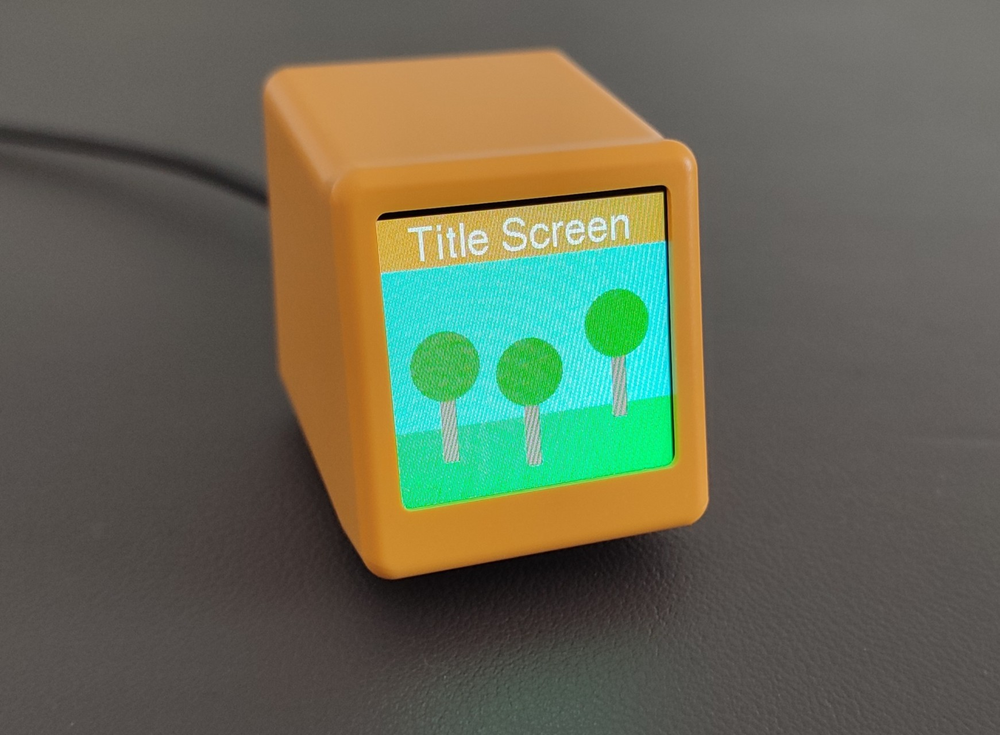

# Display Firmware

Display firmware for using the MQTT upload feature in the desktop app. The software currently only supports the ESP8266 based display cube from GeekMagic which can be found on AliExpress. Other screens can be used with small modifications to the code.



## Programming
The screen shown above is programmed using the row of debug pads below the screen with the following pinout:
| Pin | Signal |
| --- | ------ |
| 1   | GND    |
| 2   | TXD0   |
| 3   | RXD0   |
| 4   | 3V3    |
| 5   | GPIO0  |
| 6   | RST    |

## Configuration
Create `src/config.h`
```cpp
#define WIFI_SSID "<qifi_ssid>"
#define WIFI_PASSWORD "<wifi_password>"
#define MQTT_BROKER "<mqtt_hostname>"
#define MQTT_PORT 1883
#define MQTT_USER "<mqtt_username>"
#define MQTT_PASSWORD "<mqtt_password>"
#define MQTT_TOPIC "display/minidisplay01"
#define OTA_PASSWORD "<ota_password>"
#define DEV_NAME "MiniDisplay"
```

Create `platformio_override.ini`
```ini
[env:ota-update]
upload_protocol = espota
upload_port = <device_ip>
upload_flags =
    --auth=<ota_password>
```

## Supported commands
```json
[
    {
        "t": "fill",
        "c": 0
    },
    {
        "t": "rect",
        "x": 0,
        "y": 0,
        "w": 240,
        "h": 20,
        "r": 4,
        "c": 14836,
        "f": true
    },
    {
        "t": "circle",
        "x": 100,
        "y": 100,
        "r": 20,
        "c": 14836,
        "f": true
    },
    {
        "t": "halfcircle",
        "x": 100,
        "y": 100,
        "r": 20,
        "co": 15,
        "c": 14836,
        "f": true
    },
    {
        "t": "triangle",
        "x0": 120,
        "y0": 0,
        "x1": 0,
        "y1": 239,
        "x2": 239,
        "y2": 239,
        "c": 14836,
        "f": true
    },
    {
        "t": "line",
        "x0": 10,
        "y0": 10,
        "x1": 30,
        "y1": 50,
        "c": 14836
    },
    {
        "t": "text",
        "co": "Hallo Welt",
        "x": 10,
        "y": 10,
        "s": 1,
        "c": 14836
    },
    {
        "t": "bitmap",
        "x": 0,
        "y": 0,
        "w": 240,
        "h": 240,
        "c": 65535
    }
]
```
